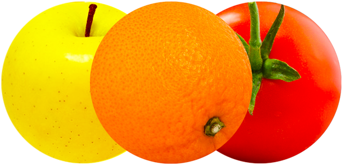
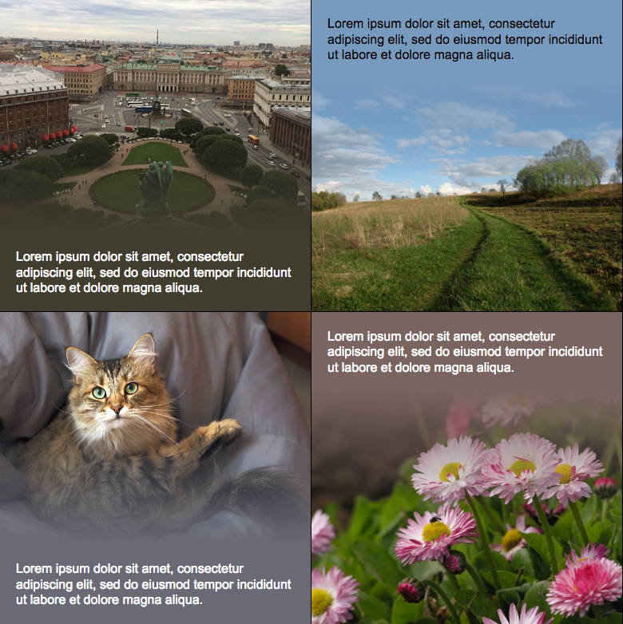
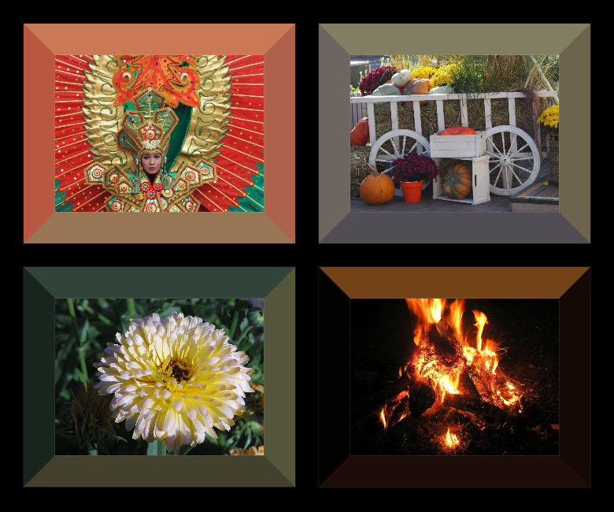
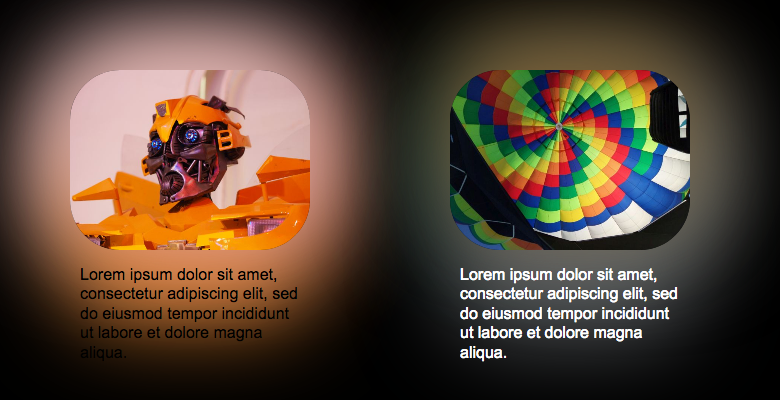

# Усреднённый цвет в JavaScript



По работе делал листалку фотографий. Сопровождающий текст было решено положить на усреднённый цвет фото. Тема среднего цвета заинтересовала, и я решил
посмотреть какие ещё варианты можно использовать в верстке.

## Фон
Рассчитываем средний цвет фотографии и устанавливаем цвет подложки. [Пример](https://hcodes.github.io/fast-average-color/examples/background.html)


## Градиент
Средний цвет высчитывается у верхней или нижней части картинки и используется в подложке для текста. Между картинкой и подложкой установлен плавный градиент. Стиль Яндекс.Дзена. [Пример](https://hcodes.github.io/fast-average-color/examples/gradient.html)


Градиент в стиле Minecraft — средний цвет высчитывается частями (горизональными полосками). [Пример](https://hcodes.github.io/fast-average-color/examples/gradient_stripes.html)


## Рамка
Как багет у картины, средний цвет высчитывается отдельно у каждой из сторон фотографии.
[Пример](https://hcodes.github.io/fast-average-color/examples/border.html)


## Тень
Вычисленный средний цвет используется в задании цвета падающей тени. [Пример](https://hcodes.github.io/fast-average-color/examples/box-shadow.html)


В CSS у элемента можно задать несколько теней. Для каждой из сторон фотографии вычислим средний цвет и установим отдельную тень. [Пример](https://hcodes.github.io/fast-average-color/examples/box-shadow-4-sides.html)


## Видео
Предыдущий пример применим в динамике для видео. [Пример](https://hcodes.github.io/fast-average-color/examples/ambilight.html#4Sides)


Разделим стороны экрана на большее количество частей (30), в которых вычислим средний цвет для отбрасываемой тени, совсем как у [Philips Ambilight](https://ru.wikipedia.org/wiki/Ambilight). [Пример](https://hcodes.github.io/fast-average-color/examples/ambilight.html#ManyPoints)


## Текстовая фотография
Фотографию заполняем текстом, под каждым символом вычисляем средний цвет и применяем его к символу. [Пример](https://hcodes.github.io/fast-average-color/examples/text-photo.html)


## Использование
Для вычисления среднего цвета в примерах я использовал небольшой пакет «[fast-average-color](https://github.com/hcodes/fast-average-color)». Усреднённый цвет можно получать из картинок, видео и canvas’а. При подсчёте цвета учитывается прозрачность.

`npm i -D fast-average-color`

### Примеры

Для получения среднего цвета из загруженных картинок, видео и canvas’a используется метод [.getColor()](https://github.com/hcodes/fast-average-color#getcolorresource-options):
```html
<html>
<body>
    ...
    <div class="image-container">
        
        <div>
            Lorem ipsum dolor sit amet, consectetur adipiscing elit,
            sed do eiusmod tempor incididunt ut labore et dolore magna aliqua.
        </div>
    </div>
    <script src="https://unpkg.com/fast-average-color/dist/index.min.js"></script>
    <script>
        window.addEventListener('load', function() {
            var
                fac = new FastAverageColor(),
                container = document.querySelector('.image-container'),
                color = fac.getColor(container.querySelector('img'));

            container.style.backgroundColor = color.rgba;
            container.style.color = color.isDark ? '#fff' : '#000';

            console.log(color);
            // {
            //     error: null,
            //     rgb: 'rgb(255, 0, 0)',
            //     rgba: 'rgba(255, 0, 0, 1)',
            //     hex: '#ff0000',
            //     hexa: '#ff0000ff',
            //     value: [255, 0, 0, 255],
            //     isDark: true,
            //     isLight: false
            // }
        }, false);
    </script>
</body>
</html>
```

А для картинок, которые находятся в процессе загрузки — [.getColorAsync()](https://github.com/hcodes/fast-average-color#getcolorasyncresource-callback-options):
```html
<html>
<body>
    ...
    <div class="image-container">
        
        <div>
            Lorem ipsum dolor sit amet, consectetur adipiscing elit,
            sed do eiusmod tempor incididunt ut labore et dolore magna aliqua.
        </div>
    </div>
    <script src="https://unpkg.com/fast-average-color/dist/index.min.js"></script>
    <script>
        var
            fac = new FastAverageColor(),
            container = document.querySelector('.image-container');

        fac.getColorAsync(container.querySelector('img'), function(color) {
            container.style.backgroundColor = color.rgba;
            container.style.color = color.isDark ? '#fff' : '#000';

            console.log(color);
            // {
            //     error: null,
            //     rgb: 'rgb(255, 0, 0)',
            //     rgba: 'rgba(255, 0, 0, 1)',
            //     hex: '#ff0000',
            //     hexa: '#ff0000ff',
            //     value: [255, 0, 0, 255],
            //     isDark: true,
            //     isLight: false
            // }
        });
    </script>
</body>
</html>
````

Для картинок и видео с разных доменов стоит не забывать про [CORS](https://developer.mozilla.org/ru/docs/Web/HTTP/CORS).

Ссылки:
- [Репозитарий на Github](https://github.com/hcodes/fast-average-color)
- [Пакет в npm](https://www.npmjs.com/package/fast-average-color)
- [Примеры](https://hcodes.github.io/fast-average-color/examples/background.html)
